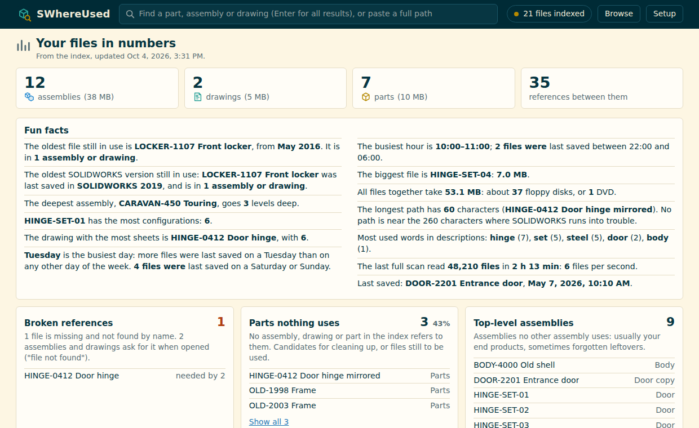
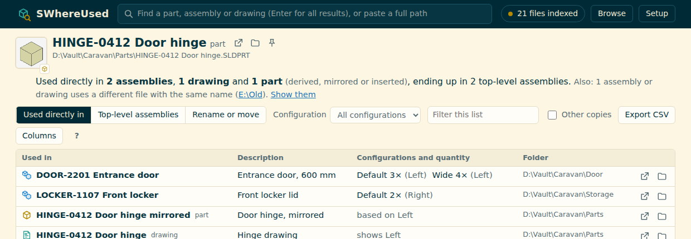
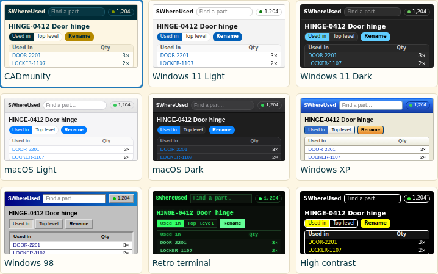
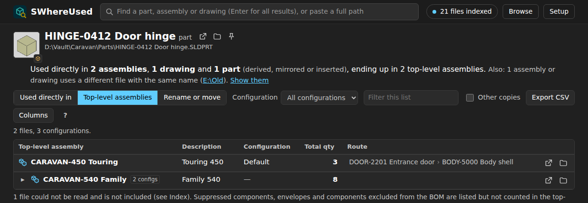
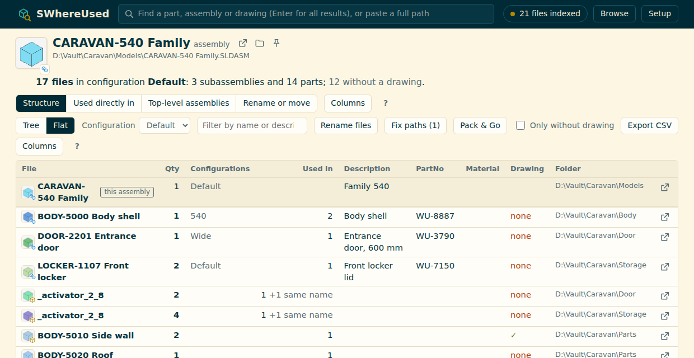
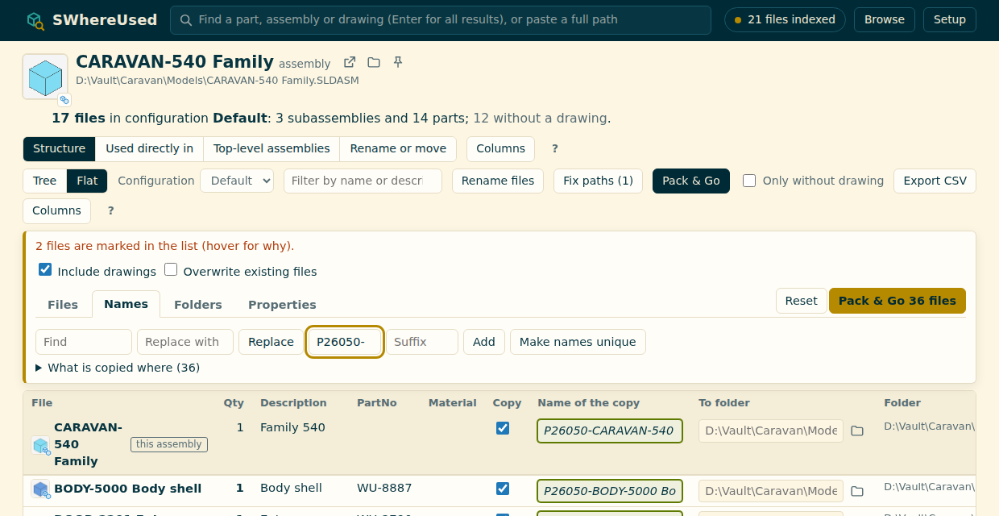
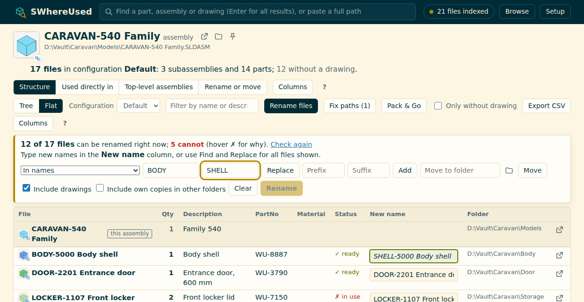
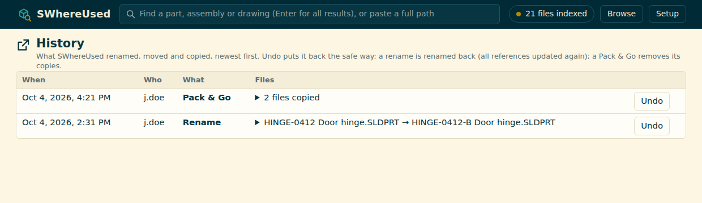

# SWhereUsed for SOLIDWORKS

> SWhereUsed is free. If it saves you time, you can **[support its development on Ko-fi](https://ko-fi.com/stefansterk)** ♥

A small local app that answers one question fast: **where is this part used?**

Search for a part, assembly or drawing and you see every assembly and drawing that references it, with the
quantity per configuration, and the top-level assemblies it ends up in (quantities multiplied all the way up).
Click any name to go one level higher. Export the list to CSV for Excel.

**Statistics** (in the Index panel, or from the start page) shows your files in numbers: broken references (files
an assembly or drawing needs that are gone and not found by name), parts nothing uses,
top-level assemblies, file names that occur in more than one folder (SOLIDWORKS finds references by name, so these
can get mixed up), parts and assemblies without a drawing or a description, the most used parts, the largest
assemblies, how much was changed per year, and how many files are in each SOLIDWORKS version (the release
they were last saved with). Click any of them to get the list. And some fun facts: the oldest file
still in use, the deepest assembly, the busiest day and hour, the longest path, and your vault in floppy disks.

**Browse** shows the folders the index knows, like Explorer, with for every file how many assemblies and
drawings use it and whether it is indexed. Unused parts and new files in a folder show up too, because the files
are read from the folder itself. Click a folder anywhere in the app to browse it.

Press Enter in the search box for a full results list, 200 at a time with the total count: filter by parts,
assemblies or drawings, sort by name, folder, date or how often they are used (sorting is done over all
results, not just the page you see), and tick **Only not used** to find parts nothing refers to.

And when a file needs a new name or a new folder: **Rename or move** does it and updates every assembly and
drawing that uses it, so nothing ends up with a missing component.

It works without PDM and without SOLIDWORKS running. It keeps its own index of your assemblies, drawings and parts,
read with the SOLIDWORKS Document Manager, and updates it in the background (only new and changed files are read).

Your CAD files are only ever changed when you rename or move one, after a check and a confirmation.

## Use at your own risk

SWhereUsed only reads your files, until you rename, move or Pack & Go: then it changes SOLIDWORKS files. It backs
up every file it changes, checks the result and puts everything back when something fails, and it can undo what
it did. Still, it comes **without any warranty** (see `LICENSE`), and you use it at your own risk:

- Keep your own backups of your SOLIDWORKS files, as you would anyway.
- Try renaming, moving and Pack & Go on a copy of a project first, and open the result in SOLIDWORKS.
- In a SOLIDWORKS PDM vault, rename and move files through PDM (SWhereUsed stops you there).

## What you need

- Windows 10 or 11 with SOLIDWORKS installed (for `SwDocumentMgr.dll`; see Troubleshooting for a pc without SOLIDWORKS).
- A **Document Manager license key**. It is free for customers with an active subscription: request it on the
  [SOLIDWORKS key request page](https://www.solidworks.com/support/subscription/key-request/) (or ask your reseller). The key belongs to your company, so it is not included here.
- Recommended: [Everything](https://www.voidtools.com/) by voidtools, with its HTTP server switched on
  (Tools, Options, HTTP Server, Enable HTTP server, port 8080). It makes finding files instant.
  SWhereUsed starts Everything for you when it is installed but not running.
  Without Everything, SWhereUsed scans folders you choose instead.
- Python is installed for you if it is missing (see below).

## Install

1. Unzip the folder anywhere, for example `C:\Tools\SWhereUsed`.
2. Double-click **`Start SWhereUsed.bat`**.
   - The first start sets up a private Python environment (about a minute). If Python is not installed, it offers to
     install it for your user account with winget (no administrator rights needed).
   - Your browser opens on `http://127.0.0.1:8790`.
3. The **Setup** page walks you through the rest: paste your license key (it is tested right away), choose Everything
   or folders, and build the index. The first index run reads every assembly, drawing and part once (the Index panel shows how far it is per type,
   how long it has been running and roughly how long it still takes; afterwards it keeps how long every run took); after that it is quick.

Keep the black window open while you use the app. Close it to stop.

Pick a look on the Setup page (or at the bottom of any page): CADmunity (the default, following Windows light or
dark), Windows 11 light or dark, macOS light or dark, Windows XP, Windows 98, a retro green terminal, or high
contrast. The choice is remembered in your browser.

To have it ready all the time, tick **Start SWhereUsed when I sign in to Windows** on the Setup page. It then starts
minimised and without opening the browser each time you sign in (a small file in your Startup folder; no
administrator rights needed). Untick it to stop that.

### From inside SOLIDWORKS (optional)

`SWhereUsed.bas` is a macro that opens the page for whatever you have selected: a component (or a face of one) in an
assembly, or a view in a drawing. With nothing selected it uses the active document.

Install it once: Tools, Macro, New, save as `SWhereUsed.swp`, delete the empty code, File, Import File, choose
`SWhereUsed.bas`. Put it on a toolbar button or shortcut. Set `APP_FOLDER` at the top of the macro to the folder
with `Start SWhereUsed.bat` and the macro starts SWhereUsed for you when it is not running.

## Structure of an assembly

Open an assembly and choose **Structure**:

- **Tree** shows the build-up as in the FeatureManager, per configuration, with quantities, configurations and
  suppressed components. **Flat** lists every file once, with the total quantity multiplied down the levels.
- It is built from the index, so it is instant and SOLIDWORKS is not needed. A component whose saved path no
  longer exists is found by name, the way SOLIDWORKS does it (marked *found by name*).
- **Rename files** adds a *New name* column, in the tree and in the flat list, and a *Status* column that is
  filled in right away, before you type anything: ✓ free, or ✗ in use, old lock or read-only, for the file, its
  drawing or any assembly or drawing that refers to it. Hover for who has what open. Type new names, or use Find and Replace on all files
  shown. A bar keeps count as you type: how many files are renamed, how many drawings go
  along, and in how many assemblies and drawings the references are updated, including how many of those are
  **outside** this assembly. Anything that stands in the way is listed there too.
- All new names are carried out as one job, with the same safety as a single rename: one backup, every file
  checked afterwards, and everything put back if anything fails. A file that uses several renamed files is
  opened and saved once. Swapping names between files is not possible in one go.
- **Find / Replace** works in the names, in the folder paths, or in both. In folder paths it **moves the files** to
  the folder that results; it does not rename a folder, and whatever else is in the old folder stays there.
  **Prefix / Suffix** add text to the names. You see the result in green while you type; Replace or Add applies it.
- **Move to folder** moves all files shown (filter first to pick them) to another folder, with their drawings.
- The flat list shows for every file whether it has a drawing, and **Only without drawing** lists the ones still to be
  made. Extra columns come from custom properties you choose (`extra_properties`, for example PartNo, Material).

## Fix paths

An assembly can name a part by a path that no longer exists, for example after a project was moved; SOLIDWORKS
then finds the part by its name in the assembly's own folder ("found by name" in SWhereUsed). That works until the
assembly is copied or moved. **Fix paths** (in the Structure, shown when there is something to fix) replaces such
paths by where the files really are: a file with that name in the assembly's own folder, or else the only file with
that name. When there are several, it is left alone. The assemblies are backed up first, every change is checked,
and Undo in History puts the old paths back.

## Pack & Go

In the structure of an assembly, **Pack & Go** copies the assembly, or part of it, under new names into another
folder. The copies refer to each other; the originals are not changed at all.

- Per file: **Copy**, or keep it, in which case the copies refer to the original (standard and purchased parts;
  Toolbox parts are kept by default).
- New names: type them, or use Replace, Prefix and Suffix on all files shown (filter first to choose).
- The assembly itself is the top row: copy it or not, give it a name. Every file can get a folder of its own
  (column "To folder"); empty means the folder worked out from the target folder.
- Conflicts are marked in the list. Red: two files would become the same copy, for example two different files
  with the same name from different folders put into one folder; this stops Pack & Go. Orange: copies with the
  same name in different folders; allowed, but in one assembly SOLIDWORKS loads only one of them.
  **Make names unique** adds the folder name to the second and further ones.
- Every folder box suggests folders: when empty, your recent and pinned folders; while typing, the folders that
  match, as in the address bar of Explorer. Enter or Tab opens the folder chosen (a \\ is added) and shows its
  subfolders, so you go down a tree with a few keys; Esc when you are there.
- Every folder box has a folder button: browse the folders on disk, go **Up**, make a **New folder**, and
  **Use this folder**. A folder that does not exist yet opens at the nearest folder above it.
- **Select by** name, folder or both (case does not matter, `*` for anything), or Ctrl+click names: Replace,
  Prefix, Suffix, Copy and Keep then work on the selection instead of on all files shown.
- **Properties of the copies**: the tab lists the custom properties found in the files being copied (in how many
  files, which values); click Clear, Delete, Set or Replace to make a rule. Rules are applied to every copy, never to the originals: *Clear value* (for example
  Revision, Approved), *Delete*, *Set to* (created when missing) and *Replace text* (for example an old project
  number). In the file (Custom tab), in every configuration, or both. Values can use {name} (name of the copy),
  {oldname} and {date}. A rule can be for any combination of parts, assemblies and drawings. Save a set of rules as a
  **profile** (for example Project copy) and pick it again next time. Each change is
  read back after saving; the rules are remembered in your browser.
- **Overwrite existing files** (off by default) replaces files that already exist in the target. They are backed up
  first and put back if anything fails. Never a file that is open, read-only, in a PDM vault, or one of the
  originals being copied. Assemblies that used an overwritten file get the copy; as a copy keeps the internal ID
  of its original, SOLIDWORKS may say the internal ID differs when they are opened.
- **Keep folder structure** rebuilds the subfolders under the target folder; untick it to put everything in one folder.
  Drawings with the same name go along and point to the copies.
- Before anything happens you see what is copied where, and what stands in the way (a file that already exists
  in the target folder, a name used twice). If anything goes wrong, the copies made so far are removed again.
- Like SOLIDWORKS Pack and Go, a copy keeps the internal ID of its original.

## Rename or move

Open a file, choose **Rename or move**, type the new name and/or folder, click **Check**, then **Rename**.

- **Check first.** The table shows every file involved, what happens to it and what it will be called afterwards.
  Anything that stands in the way is listed: a file that is open in SOLIDWORKS (with the user and computer from its
  lock file), read-only, or a lock file left behind by a crash. Leftover lock files can be removed from the table.
- **The drawing comes along.** A drawing with the same name in the same folder is renamed and moved with the model
  (untick the box to leave it).
- **All or nothing.** Every file that changes is backed up first. The files are moved, the references are replaced,
  and then every changed file is read again to verify it now points to the new file and no longer to the old one
  (in its external references: that is what SOLIDWORKS loads).
- The component list inside an assembly keeps the old name until SOLIDWORKS itself saves the assembly again.
  SWhereUsed remembers what it renamed, so the index and the structure still find the renamed file.
- Every rename is written step by step to `rename_debug.log` in the data folder, so a failure can be traced.
- Renamed with another tool that works the same way (SOLIDWORKS Explorer, PDM, a Document Manager tool)? When an
  assembly lists a file that no longer exists, SWhereUsed reads its external references too and pairs the old file
  with the new one (only when that is certain). It then follows the rename everywhere, also in drawings, and marks
  it "renamed" until SOLIDWORKS saves the assembly again. Opening and saving the assembly in SOLIDWORKS (or
  "Convert Files" in the SOLIDWORKS Task Scheduler) makes the file itself right for every tool.
  If anything fails, even a crash of the Document Manager, everything is put back: files back in their place,
  changed files restored from the backup.
- While it works, SWhereUsed puts lock files (`~$name`) next to the files, like SOLIDWORKS does, so colleagues
  cannot open them halfway.
- Backups are kept in `%USERPROFILE%\.SWhereUsed\backups` for 90 days, one folder per rename with a
  `what_happened.txt`. Every rename is logged in `rename_log.csv`.
- Derived, mirrored and inserted parts that are based on a renamed file are updated too. If such a reference
  cannot be replaced, nothing is renamed (a derived part is never left pointing to a file that is gone).
- Not updated: files that reference it and are not in the index (unreadable files are listed under Index).
- Rather not have this at all? Set `allowed = no` under `[rename]` in `settings.ini`; SWhereUsed then only reads.

## Running in the background

**Start SWhereUsed.bat** runs SWhereUsed in a window; close it to stop. **Start SWhereUsed in background.bat** runs it
without a window, with an icon by the clock: double-click the icon to open SWhereUsed, right-click it to stop.
Setup, **Getting started**, can start SWhereUsed when you sign in to Windows, in a window or in the background, and
**Help & about** has a button to stop it. Without a window, what would be printed goes to `console.log` in the data
folder (Copy diagnostics includes its last lines).

## Updating

SWhereUsed checks twice a day whether a newer version is out (Setup, **Check for updates**, checks right away).
When there is one, the footer says so, and Setup shows what is new and a button **Install update**: SWhereUsed
downloads the new version, checks it, keeps the current version as a backup in `%USERPROFILE%\.SWhereUsed\app_backups`,
puts the new files in place and starts again; the page reloads by itself. Your settings, key, index and history stay
as they are. It waits while the index is being updated or a rename or Pack & Go is busy. You can also update by hand:
download the zip and unpack it over the old folder.

## History and Undo

**History** (in the Index panel) lists everything SWhereUsed renamed, moved and copied: when, who and which files.
**Undo** (there, and right after each action) puts it back the safe way: a rename or move is done again in reverse,
with all references updated; a Pack & Go removes its copies (and puts back files it overwrote). If a copy was changed
after the Pack & Go, Undo says so first.

## Getting around

- The search box suggests files while you type, with their thumbnail; **All / Parts / Assemblies / Drawings**
  narrows them down. Enter shows all results.
- Long lists keep their column headers in view; in a deep structure the line above them shows which subassembly
  you are in (click a name to go there). **Columns** chooses which columns to show (remembered per view). Click a column header to sort
  (again for the other way, a third time for the original order); in the tree every level is sorted on its own.
- **Right-click** any file or folder in a list: Open in SOLIDWORKS, Show in folder, Where used, Structure, Rename or
  move, Copy path, Pin.
- **Pin** files and folders to the start page (right-click, or the pin button next to a file's name).
- The **?** next to a list explains every label (found by name, own folder, different file, excl. from BOM, ...).

## Asking for help

Copy diagnostics also lists actions that took longer than a second (from `slow.log` in the data folder), so it
is clear where SWhereUsed is slow on your PC.

To see what SWhereUsed reads from a file (references, configurations, properties, version), double-click
**Test a file.bat** and drag files into its window one after another (press Enter after each), or drag files onto
the .bat file in Explorer. The output is also saved in `%USERPROFILE%\.SWhereUsed\test_output.txt`.

**Setup, Copy diagnostics** collects what is needed to answer a question: versions, settings, the last index runs
and recent log lines. Never your license key or passwords. Paste it with your question. All settings can be changed
on the Setup page too (All settings); they are saved in `settings.ini`.

## Where things are stored

Everything personal lives in `%USERPROFILE%\.SWhereUsed`: `settings.ini`, your license key (`swdm_key.txt`),
the index (`index.sqlite`, tidied up once a week when the app is idle), rename backups and log, the preview
pictures (at most 500 MB, setting `thumbnail_cache_mb`), the Python environment and crash logs. This folder (and a
backup folder you set yourself) is never indexed or searched: the backups in it are copies, not your files. The app folder itself contains nothing
personal, so you can replace it with a newer version or share it without leaking your key.

To uninstall, delete the app folder and `%USERPROFILE%\.SWhereUsed`.

## Good to know

- **Copies of a project in other folders.** When the saved path in an assembly is gone, SOLIDWORKS takes a file with
  that name from the assembly's own folder first. SWhereUsed does the same: a copy of the project in folder B that
  has its own file with the same name and type is marked *own folder*. It is not counted as using folder A's file,
  and renaming folder A's file leaves it alone, unless you tick "Also update ... own file" when renaming.
- **How a reference is linked.** Every assembly and drawing stores the full path of each file it uses. SWhereUsed
  labels a reference when that path is not simply this file: *other drive* (same file, another drive letter or
  network path), *by name* (the saved path no longer exists, so it is linked by file name, as SOLIDWORKS does when
  it opens the file), or *other file* (the saved path is a different file with the same name, for example a
  Pack and Go copy; only shown when you tick Other copies). Hover a label to see the saved path and the file it means.
- **Parts are indexed too** (`include_parts = yes` under `[index]`): parts that are based on another part (derived,
  mirrored, inserted, split/saved bodies) show up in its where-used list, and parts get their description in all
  lists. The first index run takes longer, since there are usually many more parts than assemblies. Before
  reading thousands of parts, SWhereUsed tries it on a few in a separate process; if the Document Manager crashes on
  that, parts are only read for their description and the Index panel says why. Set `include_parts = no` to skip
  parts altogether. Virtual components are skipped. Suppressed components, envelopes and components excluded from
  the BOM are listed (they are used, and renaming updates them), but not counted in quantities.
- **SOLIDWORKS PDM:** only files cached in your local vault view can be read. Vault views are recognised from the
  Windows registry (where SOLIDWORKS PDM registers them), with the vault's desktop.ini as a safety net; Copy
  diagnostics lists the vaults found. Renaming and moving files in a vault
  view is blocked: outside PDM that damages the vault, so do it in PDM. Where used, Structure, Statistics and
  Pack & Go *out of* a vault work as usual; copies made *into* a vault folder are new local files to check in.
- **Very large assemblies on a slow network:** a file that takes longer than 180 seconds to read counts as stuck.
  Raise `file_timeout` under `[index]` (Setup, All settings) if that happens to big files.
- Files saved with a newer SOLIDWORKS version than your Document Manager are listed under "Files that could not be read".
- Settings you can only change in `settings.ini`: which Everything search defines the index (for example limit it
  to one folder), paths to skip, number of parallel readers, the automatic update interval, and which custom
  property is shown as Description (`Description` by default; add `Omschrijving`, `Beschreibung`, ...).

## Troubleshooting

| You see | What to do |
|---|---|
| "The app is not running" | Start `Start SWhereUsed.bat` and keep its window open. |
| The Document Manager rejected the license key | Check the key (one line, no quotes) in Setup. It must be a Document Manager key, not a SOLIDWORKS serial number. |
| SwDocumentMgr.dll not found | It comes with SOLIDWORKS. On a pc without SOLIDWORKS, copy `SwDocumentMgr.dll` and `zlib.dll` from `C:\Program Files\Common Files\SOLIDWORKS Shared` and run `regsvr32 SwDocumentMgr.dll` as administrator. |
| Everything is not reachable | Turn on the HTTP server in Everything (port 8080), or choose "Folders only" in Setup. As soon as Everything answers, the index starts by itself. |
| Port 8790 is already used by another program | Set another port under `[app]` in `settings.ini` (and in `APP_URL` in the macro). |
| Installing pywin32 and comtypes failed | Your network blocks pypi.org. Ask IT, or install them into the environment by hand (the window shows the command). |
| A rename says "open in SOLIDWORKS by ..." | Ask that person to close the file (or the assembly that contains it), then click Check again. |
| "leftover lock file" | SOLIDWORKS crashed or was killed and left `~$name` behind. When you are sure nobody has the file open, click Remove lock. |
| Something is broken after an update | Delete `%USERPROFILE%\.SWhereUsed\venv` and start again; it is rebuilt. |

For one file: `python SWhereUsed.py --test "D:\path\to\Assembly.SLDASM"` prints exactly what the index would store.
`python SWhereUsed.py --selftest` runs the automated tests (no SOLIDWORKS needed).

## How it works

`SWhereUsed.py` is a small web server (Python standard library only, plus pywin32 and comtypes for the Document Manager)
that listens on 127.0.0.1, so it is only reachable from your own pc. The index is built in a separate process: if the
Document Manager crashes on a damaged file, that file is skipped and indexing continues. A rename also runs in its
own process and writes a journal before every step, so the app can put everything back even after a crash. `SWhereUsed.html` is the page.

## Licenses and trademarks

SWhereUsed is free and open source under the **MIT License** (see `LICENSE`).

It uses only freely usable software, none of which is included in the download:

| Part | Used for | License |
|---|---|---|
| Python and its standard library | the app, its web server, the index (SQLite) | PSF License; SQLite is public domain |
| pywin32 | Windows functions (COM, registry) | PSF-2.0 |
| comtypes | talking to the Document Manager | MIT |
| SOLIDWORKS Document Manager | reading and changing SOLIDWORKS files | Dassault Systèmes; every user needs their own license key |
| Everything (voidtools) | finding files quickly, optional | freeware |

`Start SWhereUsed.bat` installs pywin32 and comtypes from PyPI on your own PC. The web page loads nothing from the
internet; its icons were drawn for SWhereUsed.

SOLIDWORKS is a registered trademark of Dassault Systèmes SolidWorks Corporation. SWhereUsed is not affiliated with
or endorsed by Dassault Systèmes.

## How it was made

SWhereUsed was designed, directed and tested on real SOLIDWORKS files by Stefan Sterk; the code was written with
Claude (an AI by Anthropic).

